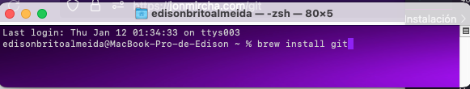

# Instalacion de Git y Github


## Proceso de Configuracion de Git

## Introducción

Este documento es una guia completa para una instalacion nueva del modulo de Git; desde el gestor de paquetes, Homebrew.

## Instalación

#### Download for macOS

There are several options for installing Git on macOS. Note that any non-source distributions are provided by third parties, and may not be up to date with the latest source release.
Homebrew

Install homebrew if you don't already have it, then:



# Configuracion inicial

## Configurando Git por primera vez

```
git config --global user.name “Edison Brito”
git config --global user.email edisonbrito1@gmail.com
git config --global user.ui true
git config --global init.defaultBranch main
```

## Inicializar Git en un directorio local

```
mkdir carpeta
cd carpeta
touch README.md
touch .gitignore
git init
code .
```

## Flujo básico

El flujo de Git, consta de tres estados locales, es decir en la computadora donde se esta trabajando y uno más de forma remota cuando accedemos al codigo centralizado en plataformas como GitHub, Gitlab, Bitbucket, etc.

Dichos estados son **_modified_**, **_staged_**, **_committed_** y **_remote_**.

A cada uno de ellos le corresponde un área de trabajo:

### **_1. Working Directory:_** Es el área correspondiente al estado **_modified_** y es la carpeta local de tu computadora donde almacenas los archivos de tu proyecto

### **_2. Staging Area:_** Es el área correspondiente al estado **_staged_** también se le llama index por que es el área donde git indexa y agrega los cambios realizados en los archivos previos a comprometerlos en su registro

### **_3. Local Repository:_** Es el área correspondiente al estado **_committed_**, donde los cambios ya se han registrado en el repositorio de git también se le llama **_HEAD_** por que indica en qué cambio se encuentra el puntero del repositorio

### **_4. Remote Repository:_** Es el área correspondiente al estado **_remote_** y es el directorio remoto donde almacenamos los archivos del proyecto en alguna plataforma web como GitHub, GitLab, BitBucket. Git denomina **_origin_** al repositorio remoto


```
# agregar los cambios de un archivo al staged
git add archivo/directorio
# agregar todos los cambios de todos los archivos al staged
git add .
# los cambios son comprometidos en el repositorio
# debes escribir el mensaje del cambio
# cuando se abra el archivo de configuración
# al terminar guarda y cierra el archivo
# para que los cambios tengan efecto
git commit
# es un shortcut del comando anterior
# escribes y confirmas el mensaje del cambio en un sólo paso
git commit -m "mensaje descriptivo del cambio"
# se agrega el origen remoto de tu repositorio de GitHub
git remote add origin https://github.com/usuario/repositorio.git
# la primera vez que vinculamos el repositorio remoto con el local
git push -u origin master
# para las subsecuentes actualizaciones, sino cambias de rama
git push
#para descargar los cambios del repositorio remoto al local
git pull
```

## Para repositorios nuevos

```
git init
git add .
git commit -m "Primer commit"
git branch -M main
git remote add origin https://github.com/usuario/repositorio.git
git push -u origin main
```

## Para repositorios existentes

```
git branch -M main
git remote add origin https://github.com/usuario/repositorio.git
git push -u origin main
```

## Para reemplazar la rama **_master_** por **_main_** en GitHub

```
# Paso 1
# Crea la rama local main y pásale el historial de la rama master
git branch -m master main


# Paso 2
# Haz un push de la nueva rama local main en el repositorio remoto de GitHub
git push -u origin main


# Paso 3
# Cambia el HEAD actual a la rama main
git symbolic-ref refs/remotes/origin/HEAD refs/remotes/origin/main
```
